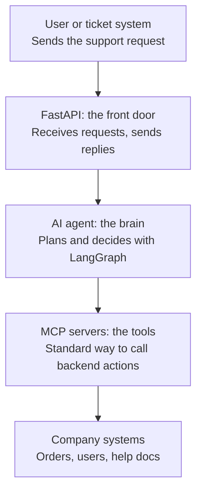
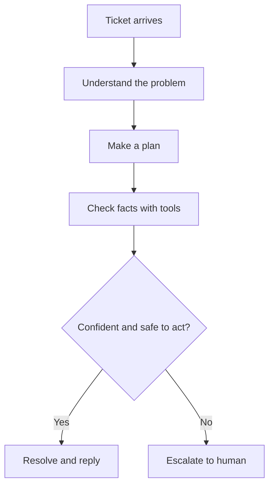
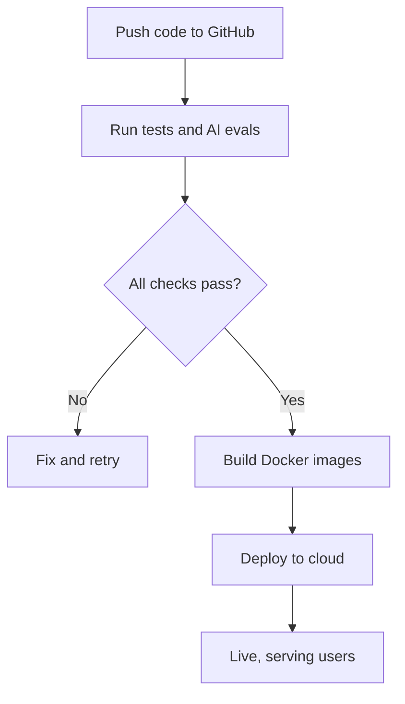

# ResolveAI Architecture

## 1. System Architecture

The diagram below shows the main parts of the system and the path a request travels. Every component is designed to run inside Docker containers on a cloud server.

### Component Details
- **FastAPI front door**: Receives tickets over HTTP, validates them, returns replies, and exposes health checks.
- **AI agent**: Built with LangGraph. Classifies intent, plans steps, evaluates tool results, and decides to act or escalate.
- **MCP servers**: Expose backend capabilities as standard tools (e.g., order lookup, refund, password reset).
- **Company systems**: The real data and services that the tools read from and act on.

---

## 2. Runtime Workflow

The steps below show what happens when a single ticket arrives. The agent acts on its own only when it is confident and the action is allowed. Otherwise, the case goes to a human.

### Ticket Lifecycle
1. A ticket arrives through the API.
2. The agent identifies the problem and its intent.
3. The agent produces a step-by-step plan.
4. The agent calls MCP tools to gather the facts it needs.
5. Before any action, a confidence and policy check runs.
6. If the check passes, the agent performs the action, sends a reply, and closes the ticket.
7. If the check fails, the agent escalates to a human with its full findings.

---

## 3. Delivery Workflow

This is how code reaches the cloud. On every push, automated tests and an agent evaluation run before anything goes live.

